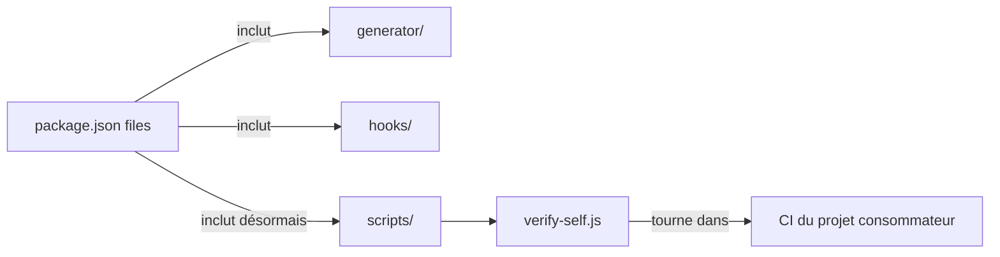

# ADR-005 — Ajout du répertoire `scripts/` aux fichiers publiés sur npm

**Date :** 2026-08-11
**Statut :** Accepté

---

## Contexte

Le projet GEF publie un package npm (`create-gef`). La liste des fichiers inclus dans
la distribution est définie via le champ `files` dans `package.json`.

Jusqu'à présent, le répertoire `scripts/` n'était pas inclus dans les fichiers publiés.
Suite à la Phase 2 de l'audit, le script `scripts/verify-self.js` a été créé. Ce script
est un outil d'audit continu qui fait partie intégrante du framework GEF installé dans
les projets consommateurs — il doit donc être distribué avec le package.

---

## Décision

Ajouter `"scripts"` à la liste `files` dans `package.json`.

---

## Options Considérées

1. **Ne pas distribuer `verify-self.js`** — L'outil resterait uniquement pour le
   développement du GEF lui-même. Problème : les projets consommateurs ne bénéficieraient
   pas du `npm run verify-self` après l'installation via `create-gef update`.

2. **Distribuer le répertoire `scripts/` entier** (décision retenue) — Simple, cohérent
   avec l'architecture existante, et permet d'ajouter d'autres scripts d'audit futurs
   sans nouvelle décision architecturale.

3. **Créer un binaire séparé `gef-doctor`** — Anticipé dans la vision stratégique de
   l'AUDIT.md (Horizon 2). Prématuré à ce stade.

---

## Conséquences

- **Positives :** Les projets qui utilisent `create-gef update` recevront automatiquement
  `verify-self.js` et pourront l'intégrer dans leur propre pipeline CI.
- **Négatives :** La taille du package npm augmente légèrement (ajout de ~5 Ko).
- **Risque :** Les scripts futurs ajoutés à `scripts/` seront automatiquement distribués.
  Il faudra veiller à n'y placer que des scripts destinés aux projets consommateurs.

---

## Diagramme

