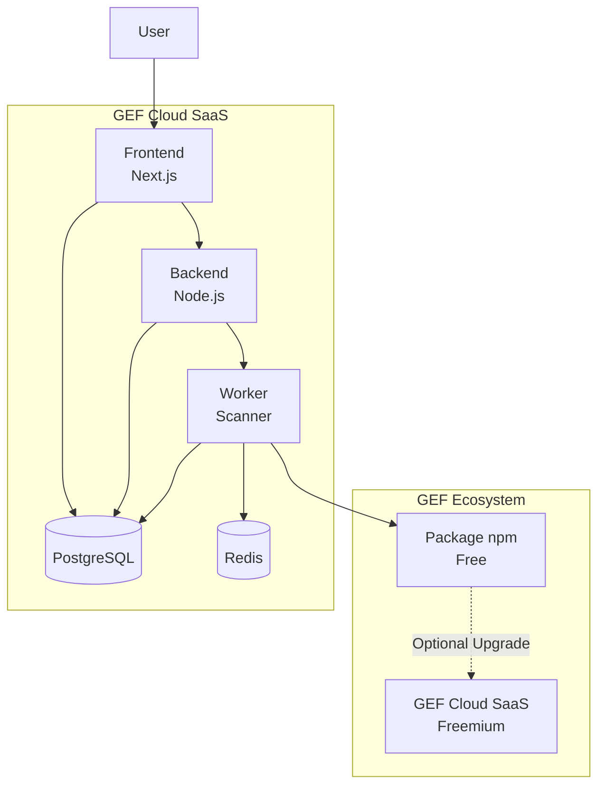

# ADR-006 — Pivot vers SaaS GEF Cloud

**Status:** Accepté
**Date:** 2026-08-11
**Decision-makers:** Gildas Nzikouné
**Issue:** #85

---

## Contexte

Le GEF est actuellement un package npm open-source qui s'installe localement via `npx create-gef`. Bien que l'adoption soit croissante, il y a plusieurs limitations :

1. **Pas de vision centralisée** : Les organisations ne peuvent pas voir la conformité GEF de tous leurs projets en un seul endroit
2. **Pas de visualisation DORA** : Les métriques DORA sont partiellement couvertes mais pas visualisées
3. **Pas de configuration centralisée** : Chaque projet doit être configuré individuellement
4. **Pas de rapports enterprise** : Impossible de générer des rapports pour la direction

Le marché des outils de gouvernance d'ingénierie est en croissance (SonarQube, Linear, GitHub Advanced Security), mais aucun n'est conçu spécifiquement pour l'ère des agents IA autonomes.

## Décision

Transformer le GEF d'un package npm open-source en une plateforme SaaS de gouvernance d'ingénierie avec un modèle Freemium :

- **Phase 1 (MVP)** : Dashboard DORA pour un seul projet
- **Phase 2 (Growth)** : Gouvernance multi-projets et rapports
- **Phase 3 (Enterprise)** : SSO, RBAC, API pour intégrations

Le package npm restera gratuit et open-source, mais le SaaS offrira des features premium.

## Options Considérées

### Option A : Continuer comme package npm uniquement
**Avantages :**
- Simplicité (pas d'infrastructure à gérer)
- Focus sur le code, pas sur le business
- Communauté open-source pure

**Inconvénients :**
- Pas de revenus
- Pas de vision centralisée
- Difficile de mesurer l'adoption
- Limité par l'installation locale

### Option B : SaaS complet (remplacer le package npm)
**Avantages :**
- Business model clair
- Infrastructure centralisée
- Mesure d'adoption facile

**Inconvénients :**
- Perte de la communauté open-source
- Barrière à l'entrée (nécessite un compte)
- Risque d'adoption faible (les développeurs n'aiment pas les SaaS "boss")
- Complexe à maintenir

### Option C : Hybrid (package npm + SaaS Freemium) ✅ CHOISI
**Avantages :**
- Communauté open-source préservée (package npm gratuit)
- Revenus potentiels via SaaS premium
- Barrière à l'entrée basée (on peut commencer avec le package)
- Flexibilité (les entreprises peuvent choisir le niveau d'engagement)

**Inconvénients :**
- Complexité (maintenir deux produits)
- Risque de cannibalisation (SaaS vs package)
- Infrastructure à gérer

**Raison du choix :** L'option C offre le meilleur équilibre entre préservation de la communauté open-source et opportunité business. Elle permet d'atteindre un large public avec le package npm tout en offrant des features premium pour les entreprises.

## Conséquences

### Positives
- **Revenus** : Modèle Freemium permet de monétiser sans sacrifier l'open-source
- **Adoption** : Package npm facilite l'adoption, SaaS permet l'engagement
- **Innovation** : Revenus permettent d'investir dans le développement
- **Visibilité** : SaaS permet de mesurer l'adoption et d'itérer

### Négatives
- **Complexité** : Maintenir deux produits (package npm + SaaS)
- **Infrastructure** : Coût et complexité opérationnelle
- **Support** : Nécessite du support pour les utilisateurs SaaS
- **Sécurité** : Gestion des données clients, compliance SOC2

### Neutres
- **Communauté** : La communauté open-source reste intacte
- **Roadmap** : Le package npm continue d'évoluer, le SaaS ajoute des features

## Implémentation

### Phase 1 (MVP) — 3-4 mois
- Dashboard DORA pour un seul projet
- Authentification GitHub OAuth
- Intégration avec le GEF existant (doctor CLI)
- Infrastructure : Next.js + PostgreSQL + Redis

### Phase 2 (Growth) — 4-6 mois
- Gouvernance multi-projets
- Rapports PDF/CSV
- Configuration centralisée
- Stripe payments

### Phase 3 (Enterprise) — 6-8 mois
- SSO (Okta, Auth0, Azure AD)
- RBAC
- API REST
- Intégrations Slack/Teams/Jira
- SOC2 Type II compliance

## Diagramme d'Architecture

## Alternatives Non Retenues

- **Modèle license-only** : Difficile de monétiser sans SaaS
- **Partenariat avec SonarQube** : Perte d'indépendance, alignement pas évident
- **Acquisition par GitHub/Microsoft** : Trop tôt, produit pas mature

## Notes

- Le package npm restera le cœur du GEF (open-source, gratuit)
- Le SaaS sera construit autour du package npm, pas en remplacement
- La décision sera réévaluée après la Phase 1 (MVP) en fonction de l'adoption
- ADR à réviser après 6 mois de lancement du MVP

---

*Conforme au ENGINEERING_PLAYBOOK.md (§7 Documentation Diátaxis)*
