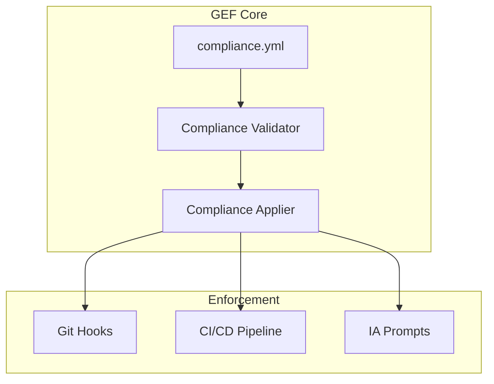

# ADR-007 — Compliance as Code

**Status:** Accepté
**Date:** 2026-08-15
**Decision-makers:** Gildas Nzikoune
**Issue:** #89

---

## Contexte

Le GEF est actuellement un framework avec des règles codées en dur dans le code source (hooks, CI/CD, prompts IA). Cette approche a plusieurs limitations :

1. **Flexibilité limitée** : Modifier les règles nécessite de modifier le code du framework
2. **Difficile à versionner** : Les changements de règles ne sont pas traçables dans Git
3. **Pas de personnalisation facile** : Chaque projet doit utiliser les mêmes règles
4. **Difficile à auditer** : Pas de vue d'ensemble des règles appliquées

Le marché des outils de gouvernance (Spec Kit, Terraform, Ansible) converge vers une approche "as Code" pour la configuration.

## Décision

Introduire **Compliance as Code** dans GEF via un fichier `compliance.yml` déclaratif qui définit toutes les règles d'ingénierie d'un projet.

### Structure de compliance.yml

```yaml
version: '1.0.0'
gef:
  strictness: Standard
  hard_limits:
    max_function_lines: 30
    max_params: 3
    max_complexity: 10
    max_file_lines: 400
    max_nesting_depth: 3
  security:
    enforce_owasp: true
    secret_detection: true
    jwt_expiry: 900
    rate_limit_max_attempts: 5
    rate_limit_window: 15
  git:
    strategy: GitHub Flow
    enforce_conventional_commits: true
    require_ticket_reference: true
    block_push_main: true
  testing:
    require_unit_tests: true
    require_integration_tests: true
    min_coverage_percentage: 80
dora:
  targets:
    deployment_frequency: per_day
    lead_time_hours: 24
    change_failure_rate: 15
    time_to_restore_hours: 1
  benchmarks:
    deployment_frequency:
      elite: multiple_per_day
      high: per_day
      medium: per_week
      low: per_month
    lead_time_hours:
      elite: 1
      high: 24
      medium: 168
      low: 720
    change_failure_rate:
      elite: 5
      high: 15
      medium: 30
      low: 45
    time_to_restore_hours:
      elite: 1
      high: 24
      medium: 168
      low: 720
extensions:
  enabled: []
  custom_rules: {}
```

## Options Considérées

### Option A : Continuer avec règles codées en dur
**Avantages :**
- Simplicité (pas de fichier de configuration)
- Performance (pas de parsing)
- Moins de surface d'erreur

**Inconvénients :**
- Flexibilité limitée
- Difficile à personnaliser
- Pas de versioning des règles

### Option B : Fichier JSON
**Avantages :**
- Facile à parser
- Compatible avec les outils existants

**Inconvénients :**
- Pas de commentaires
- Verbeux
- Moins lisible pour les humains

### Option C : Fichier YAML ✅ CHOISI
**Avantages :**
- Lisible et commentable
- Standard de l'industrie (Kubernetes, Ansible, etc.)
- Supporté par de nombreux outils
- Facile à versionner

**Inconvénients :**
- Nécessite une dépendance (js-yaml)
- Indentation sensible

**Raison du choix :** YAML est le standard de l'industrie pour la configuration as Code. Il offre le meilleur équilibre entre lisibilité humaine et compatibilité outil.

## Conséquences

### Positives
- **Flexibilité** : Les règles peuvent être personnalisées par projet
- **Versioning** : Les changements de règles sont traçables dans Git
- **Auditabilité** : Vue d'ensemble claire des règles appliquées
- **Diff** : Les changements de règles sont visibles via Git diff
- **Extensibilité** : Facile d'ajouter de nouvelles règles

### Négatives
- **Complexité** : Ajout d'une couche de configuration
- **Dépendance** : Nécessite js-yaml
- **Validation** : Nécessite validation YAML supplémentaire
- **Migration** : Projets existants nécessitent migration

### Neutres
- **Performance** : Parsing YAML négligeable (< 10ms)
- **Backward compatibility** : Ancien système toujours supporté

## Implémentation

### Phase 1 (Actuelle)
- [x] Module compliance.js avec génération et validation
- [x] Commande CLI `npx create-gef compliance generate/validate`
- [x] Template compliance.yml par défaut
- [x] Tests unitaires
- [x] Documentation

### Phase 2 (Future)
- [ ] Application automatique dans hooks Git
- [ ] Application automatique dans CI/CD
- [ ] Génération de compliance.yml lors de `npx create-gef`
- [ ] Intégration avec Certification System
- [ ] Extension System basé sur compliance.yml

## Diagramme d'Architecture



## Alternatives Non Retenues

- **TOML** : Moins standard que YAML
- **INI** : Trop limité pour la complexité requise
- **Fichier custom** : Perte d'interopérabilité

## Notes

- Le fichier compliance.yml est optionnel par défaut
- Les valeurs par défaut sont basées sur la stricité choisie (Startup, Standard, Mission Critical)
- La validation est automatique lors des commits (via hooks)
- L'application dans la CI est recommandée mais optionnelle

---

*Conforme au ENGINEERING_PLAYBOOK.md (§7 Documentation Diátaxis)*