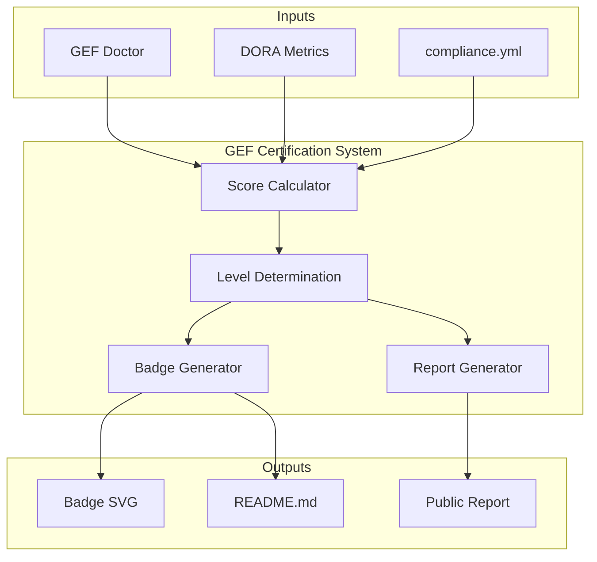

# ADR-008 — Certification System

**Status:** Accepté
**Date:** 2026-08-15
**Decision-makers:** Gildas Nzikoune
**Issue:** #89

---

## Contexte

Le GEF Compliance as Code (ADR-007) permet de définir les règles d'ingénierie de manière déclarative via `compliance.yml`. Cependant, il n'existe pas de mécanisme pour valider formellement que ces règles sont respectées et pour reconnaître les projets qui atteignent un niveau d'excellence.

Le marché des certifications de qualité (ISO 9001, SOC2, CMMI) montre que les organisations cherchent à démontrer leur conformité aux standards. GEF需要一个类似于Spec Kit的质量保证机制，但是专门针对工程治理。

## Décision

Introduire un **Certification System** pour GEF avec 4 niveaux de certification basés sur la conformité GEF et les métriques DORA.

### Niveaux de Certification

| Niveau | Critères GEF | Critères DORA | Description |
|--------|---------------|---------------|-------------|
| **Bronze** | ≥ 60% | ≥ 40% | Conformité de base GEF avec métriques DORA minimales |
| **Silver** | ≥ 70% | ≥ 60% | Conformité GEF solide avec métriques DORA acceptables |
| **Gold** | ≥ 85% | ≥ 80% | Excellence GEF avec métriques DORA élevées |
| **Platinum** | ≥ 95% | ≥ 95% | Excellence GEF parfaite avec métriques DORA elite |

### Livrables de Certification

- **Badge SVG** : Badge généré automatiquement pour README.md
- **Rapport public** : GEF_CERTIFICATION_REPORT.md avec détails
- **Audit trail** : Historique des scans et améliorations
- **Score calculé** : GEF Score + DORA Score

## Options Considérées

### Option A : Certification unique
**Avantages :**
- Simplicité (un seul niveau)
- Facile à comprendre

**Inconvénients :**
- Pas d'incitation à l'amélioration
- Difficile de distinguer les projets excellents

### Option B : Certification continue (score seul)
**Avantages :**
- Flexibilité maximale
- Granularité fine

**Inconvénients :**
- Difficile à communiquer
- Pas de "goal" clair

### Option C : 4 niveaux hiérarchiques ✅ CHOISI
**Avantages :**
- Clarté et progression
- Gamification motivante
- Standard de l'industrie (Bronze/Silver/Gold/Platinum)
- Aligné avec DORA benchmarks

**Inconvénients :**
- Plus complexe à implémenter
- Seuils arbitraires

**Raison du choix :** Les 4 niveaux hiérarchiques sont un standard de l'industrie qui permet une progression claire et motivante, tout en restant simples à comprendre.

## Conséquences

### Positives
- **Reconnaissance** : Les projets peuvent démontrer leur excellence
- **Motivation** : Incitation à l'amélioration continue
- **Visibilité** : Badges publics sur README.md
- **Audit trail** : Historique des certifications
- **Différenciation** : Unique dans l'écosystème IA-first

### Négatives
- **Complexité** : Ajout d'un système de certification
- **Maintenance** : Seuils et critères à maintenir
- **Potentiel abus** : Possibilité de "gaming" du système

### Neutres
- **Optionnel** : La certification n'est pas obligatoire
- **Backward compatible** : Ancien système toujours supporté

## Implémentation

### Phase 1 (Actuelle)
- [x] Module certification.js avec calcul scores
- [x] Détermination niveau certification
- [x] Génération badge SVG
- [x] Génération rapport public
- [x] Commande CLI `npx create-gef certify check/generate`
- [x] Tests unitaires
- [x] Documentation

### Phase 2 (Future)
- [ ] Intégration avec compliance.yml
- [ ] Validation automatique dans CI/CD
- [ ] Audit trail en base de données
- [ ] Dashboard de certification
- [ ] Marketplace de projets certifiés

## Diagramme d'Architecture

## Alternatives Non Retenues

- **5 niveaux** : Trop complexe pour le MVP
- **Certification payante** : Contre la philosophie open-source
- **Certification par tierce** : Perte d'indépendance

## Notes

- La certification est basée sur les scores GEF et DORA
- Les badges sont générés automatiquement en SVG
- Le rapport public contient l'audit trail
- La certification peut être regénérée à tout moment
- Les niveaux sont alignés avec les benchmarks DORA industry

---

*Conforme au ENGINEERING_PLAYBOOK.md (§7 Documentation Diátaxis)*