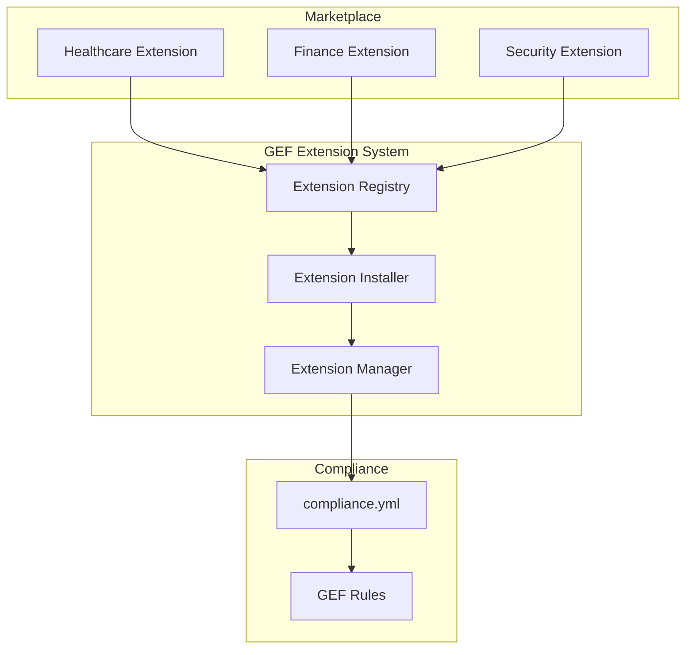

# ADR-009 — Extension System

**Status:** Accepté
**Date:** 2026-08-16
**Decision-makers:** Gildas Nzikoune
**Issue:** #89

---

## Contexte

Le GEF Compliance as Code (ADR-007) permet de définir les règles d'ingénierie de manière déclarative via `compliance.yml`. Cependant, les règles de gouvernance varient considérablement selon l'industrie (Healthcare, Finance, GovTech), le framework (React, Node, Python, Rust) et les standards de sécurité (OWASP, GDPR, PCI-DSS, SOC2).

Actuellement, les développeurs doivent configurer manuellement ces règles dans `compliance.yml`, ce qui est :
- **Chronophage** : Recherche et configuration manuelle des règles spécifiques
- **Erreur-prone** : Risque d'oublier des règles critiques
- **Non scalable** : Difficile de partager des configurations entre projets

Le marché des outils de gouvernance (Terraform, Ansible, Policy as Code) converge vers une approche modulaire avec des packs de règles prédéfinis.

## Décision

Introduire un **Extension System** pour GEF qui permet d'installer des packs de règles spécifiques par industrie, framework ou standard de sécurité via une marketplace intégrée.

### Structure d'une Extension

Une extension GEF est définie dans le module avec :
- **Nom et version** : Métadonnées de l'extension
- **Catégorie** : industry, framework, security
- **Règles** : Hard Limits, Security Rules, Git Strategy spécifiques
- **Description** : Documentation de l'extension

### Marketplace Intégré

Le marketplace est intégré directement dans le module `extension.js` avec :
- **3 extensions par défaut** : Healthcare (HIPAA), Finance (PCI-DSS), Security (OWASP étendu)
- **Registry GitHub** : Futur support pour extensions communautaires
- **Versioning** : Gestion des versions et dépendances

### Commandes CLI

```bash
# Installer une extension
npx create-gef extension install healthcare

# Lister les extensions installées et disponibles
npx create-gef extension list

# Désinstaller une extension
npx create-gef extension remove healthcare
```

## Options Considérées

### Option A : Configuration manuelle par projet
**Avantages :**
- Simplicité (pas de système d'extension)
- Contrôle total sur la configuration

**Inconvénients :**
- Chronophage (configuration manuelle)
- Erreur-prone (oubli de règles critiques)
- Non scalable (difficile de partager)

### Option B : Marketplace web externe
**Avantages :**
- Découverte facile des extensions
- Interface UI pour les utilisateurs

**Inconvénients :**
- Dépendance externe
- Complexité à maintenir
- Retard dans le développement

### Option C : Marketplace intégré avec registry local ✅ CHOISI
**Avantages :**
- Simplicité (pas de dépendance externe)
- Performance (accès local)
- Extensibilité (facile d'ajouter des extensions)
- Contrôle total sur la qualité

**Inconvénients :**
- Limité aux extensions officielles pour l'instant
- Marketplace web futur requis pour communauté

**Raison du choix :** Marketplace intégré avec registry local offre le meilleur équilibre entre simplicité, performance et extensibilité pour le MVP. Marketplace web peut être ajouté dans une phase ultérieure.

## Conséquences

### Positives
- **Flexibilité** : Extensions installables selon les besoins du projet
- **Scalabilité** : Extensions réutilisables entre projets
- **Productivité** : Installation rapide de packs de règles prédéfinis
- **Qualité** : Extensions officielles validées par GEF
- **Extensibilité** : Facile d'ajouter de nouvelles extensions

### Négatives
- **Complexité** : Ajout d'un système d'extension
- **Maintenance** : Maintenance des extensions officielles
- **Validation** : Nécessité de valider les extensions soumises

### Neutres
- **Optionnel** : Extensions non obligatoires pour le fonctionnement de base
- **Backward compatible** : Ancien système toujours supporté sans extensions

## Implémentation

### Phase 1 (Actuelle)
- [x] Module extension.js avec marketplace intégré
- [x] 3 extensions par défaut (Healthcare, Finance, Security)
- [x] Commande CLI `npx create-gef extension install/list/remove`
- [x] Merge automatique avec compliance.yml
- [x] Tests unitaires
- [x] Documentation
- [x] ADR-009

### Phase 2 (Future)
- [ ] Template pour créer des extensions
- [ ] Marketplace web pour communauté
- [ ] Review automatique des extensions soumises
- [ ] Système de contribution communautaire
- [ ] Extensions premium (optionnel)

## Diagramme d'Architecture



## Alternatives Non Retenues

- **NPM packages externes** : Trop complexe pour le MVP, dépendance externe
- **Fichiers JSON locaux** : Difficile à découvrir et partager
- **Configuration SaaS uniquement** : Contre la philosophie open-source

## Notes

- Les extensions sont optionnelles par défaut
- Les extensions sont versionnées pour compatibilité
- Le merge avec compliance.yml est automatique
- Les extensions peuvent être cumulées (installe plusieurs extensions)
- Les règles GEF de base restent toujours applicables
- Les extensions ne peuvent pas supprimer les règles GEF de base

---

*Conforme au ENGINEERING_PLAYBOOK.md (§7 Documentation Diátaxis)*