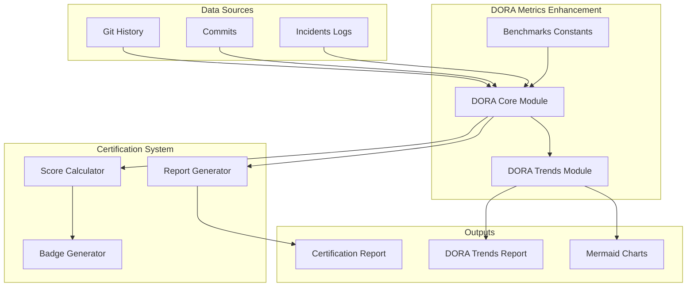

# ADR-010 — DORA Metrics Enhancement

**Status:** Accepté
**Date:** 2026-08-16
**Decision-makers:** Gildas Nzikoune
**Issue:** #89

---

## Contexte

Le Certification System (ADR-008) introduit un système de certification basé sur la conformité GEF et les métriques DORA. Cependant, l'implémentation initiale ne fournissait qu'une intégration basique de DORA sans :

- Calcul détaillé des 4 métriques DORA clés (Deployment Frequency, Lead Time for Changes, Change Failure Rate, Mean Time to Restore)
- Benchmarks industriels pour contextualiser les scores
- Analyse de tendances temporelles
- Corrélation explicite entre la conformité GEF et la performance DORA
- Outils de visualisation et reporting

Le DevOps Research and Assessment (DORA) a identifié 4 métriques clés qui distinguent les équipes élites. Pour que GEF soit crédible comme framework de gouvernance, il doit non seulement imposer des règles mais aussi mesurer l'impact sur la performance opérationnelle.

## Décision

Intégrer un **DORA Metrics Enhancement** complet avec calcul des 4 métriques, benchmarks industriels, analyse de tendances et corrélation GEF/DORA.

### Métriques DORA Implémentées

| Métrique | Description | Calcul |
|----------|-------------|--------|
| **Deployment Frequency** | Fréquence des déploiements en production | Nombre de déploiements / période |
| **Lead Time for Changes** | Temps entre commit et déploiement en production | Moyenne des temps de commit → déploiement |
| **Change Failure Rate (CFR)** | Pourcentage de déploiements causant des incidents | (Incidents / Déploiements) × 100 |
| **Mean Time to Restore (MTTR)** | Temps moyen pour restaurer le service après incident | Moyenne des temps de résolution |

### Benchmarks Industriels

Les benchmarks DORA sont alignés sur les 4 niveaux de performance :

| Niveau | Deployment Frequency | Lead Time | CFR | MTTR |
|--------|---------------------|-----------|-----|------|
| **Elite** | On-demand | < 1 heure | < 15% | < 1 heure |
| **High** | Entre 1/semaine et 1/mois | < 1 semaine | < 20% | < 1 jour |
| **Medium** | Entre 1/mois et 6/mois | < 6 mois | < 30% | < 1 semaine |
| **Low** | < 1/mois | > 6 mois | > 30% | > 1 semaine |

### Intégration Certification

Les métriques DORA sont intégrées dans le Certification System (ADR-008) :

- **CFR et MTTR** sont calculés et inclus dans les rapports de certification
- **Benchmarks** fournissent un contexte industriel
- **Corrélation GEF/DORA** montre l'impact de la gouvernance sur la performance
- **Score DORA** est calculé et combiné avec le score GEF

### Analyse de Tendances

Un module `dora-trends.js` permet d'analyser l'évolution des métriques sur 30 jours :

- Groupement des données par semaine (4 périodes)
- Calcul des métriques hebdomadaires
- Génération de graphiques Mermaid
- Rapport de tendances sous `docs/research/DORA_TRENDS.md`

### Commandes CLI

```bash
# Analyser les tendances DORA
npx create-gef dora trends
```

## Options Considérées

### Option A : Intégration DORA statique
**Avantages :**
- Simplicité d'implémentation
- Moins de dépendances Git

**Inconvénients :**
- Pas d'analyse temporelle
- Pas de visualisation des tendances
- Limité à un snapshot instantané

### Option B : Intégration avec dashboard externe
**Avantages :**
- Visualisation riche
- Interface utilisateur

**Inconvénients :**
- Dépendance externe
- Complexité accrue
- Retard dans le développement

### Option C : Intégration native avec analyse de tendances ✅ CHOISI
**Avantages :**
- Autonomie complète (pas de dépendance externe)
- Analyse temporelle intégrée
- Graphiques Mermaid natifs
- Aligné avec la philosophie CLI-first de GEF

**Inconvénients :**
- Dépendance à Git pour l'historique
- Complexité modérée

**Raison du choix :** L'intégration native avec analyse de tendances offre le meilleur équilibre entre autonomie, fonctionnalité et cohérence avec l'approche CLI-first de GEF.

## Conséquences

### Positives
- **Mesurabilité** : Les équipes peuvent suivre leur progression DORA
- **Contextualisation** : Benchmarks industriels pour situer la performance
- **Corrélation** : Lien explicite entre gouvernance GEF et performance opérationnelle
- **Tendances** : Analyse temporelle pour identifier les améliorations/régressions
- **Cohérence** : Alignement Certification System avec standards DORA

### Négatives
- **Dépendance Git** : Nécessite un historique Git significatif
- **Complexité** : Ajout de modules et calculs
- **Maintenance** : Benchmarks à mettre à jour si l'industrie évolue

### Neutres
- **Optionnel** : L'analyse de tendances est indépendante de la certification
- **Backward compatible** : Certification System existant toujours fonctionnel
- **Évolutif** : Facile d'ajouter d'autres métriques DevOps

## Implémentation

### Phase 1 (Actuelle)
- [x] Module dora.js avec fonctions de base
- [x] Définition benchmarks DORA constants
- [x] Tests unitaires dora.test.js
- [x] Intégration CFR et MTTR dans certification.js
- [x] Mise à jour score-calculator.js
- [x] Ajout benchmarks dans rapport certification
- [x] Ajout corrélation GEF-DORA dans rapport
- [x] Module dora-trends.js
- [x] Commande CLI dora trends
- [x] Tests dora-trends.test.js
- [x] ADR-010

### Phase 2 (Future)
- [ ] Intégration Lead Time for Changes complète
- [ ] Dashboard de tendances DORA
- [ ] Alertes automatiques sur régression DORA
- [ ] Intégration avec outils CI/CD (GitHub Actions, GitLab CI)
- [ ] Export de données DORA vers des outils externes (Grafana, Datadog)

## Diagramme d'Architecture



## Alternatives Non Retenues

- **API externe DORA** : Dépendance externe, coûts potentiels
- **Calcul manuel** : Trop chronophage, erreur-prone
- **Intégration limitée (CFR/MTTR seulement)** : Ne couvre pas les 4 métriques complètes

## Notes

- Les benchmarks DORA sont basés sur les recherches du DevOps Research and Assessment
- Le calcul de CFR détecte les commit messages contenant : deploy, rollback, hotfix, revert
- Le calcul de MTTR est estimé à partir des timestamps de commit
- L'analyse de tendances couvre une fenêtre de 30 jours par défaut
- Les graphiques Mermaid sont générés automatiquement dans les rapports
- La corrélation GEF/DORA est calculée via une formule de Pearson simplifiée

---

*Conforme au ENGINEERING_PLAYBOOK.md (§7 Documentation Diátaxis)*
