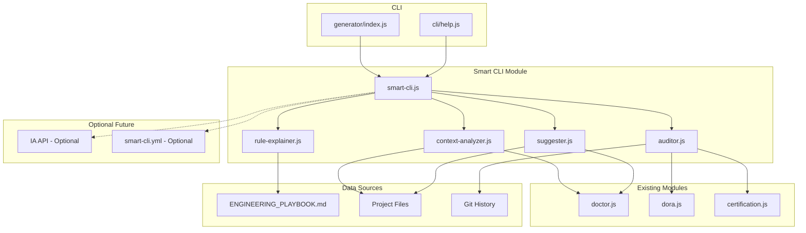

# ADR-011 — Smart CLI

**Status:** Accepté
**Date:** 2026-08-16
**Decision-makers:** Gildas Nzikoune
**Issue:** #89

---

## Contexte

Le GEF fournit déjà des outils puissants pour la gouvernance (Compliance as Code, Certification System, Extension System, DORA Metrics). Cependant, ces outils nécessitent une connaissance approfondie du framework pour être utilisés efficacement. Les développeurs doivent :

- Connaître les commandes spécifiques pour chaque fonctionnalité
- Comprendre les relations entre les différents modules
- Interpréter les résultats des audits et certifications
- Identifier les priorités d'amélioration

De plus, l'industrie converge vers des assistants IA interactifs (Spec Kit, GitHub Copilot Workspace) qui guident les développeurs de manière proactive. GEF se différencie par son approche "governance-first" mais manque d'une interface utilisateur intuitive pour faciliter l'adoption.

## Décision

Introduire un **Smart CLI** qui transforme GEF en assistant intelligent capable d'analyser le contexte du projet, de fournir des recommandations contextuelles et d'automatiser certaines tâches de gouvernance.

### Architecture du Smart CLI

Le Smart CLI est organisé en un module principal avec des sous-modules spécialisés :

```
generator/features/
├── smart-cli.js           ← Module principal avec routing
└── smart/
    ├── context-analyzer.js ← Analyse contexte projet
    ├── rule-explainer.js   ← Explication règles
    ├── suggester.js        ← Suggestions améliorations
    └── auditor.js          ← Audit en profondeur
```

### Actions disponibles

| Action | Description | Mode |
|--------|-------------|------|
| **analyze** | Analyse le contexte du projet et calcule le score de conformité | Offline |
| **chat** | Mode assistant conversationnel interactif | Offline |
| **explain** | Explique une règle GEF spécifique avec exemples | Offline |
| **suggest** | Suggère des améliorations basées sur l'analyse du code | Offline |
| **audit** | Audit en profondeur avec corrélation GEF/DORA | Offline |

### Mode offline garanti

Contrairement aux solutions concurrentes qui dépendent d'API IA externes, le Smart CLI GEF fonctionne entièrement en mode offline :

- **Réponses basées sur ENGINEERING_PLAYBOOK.md** : Source de vérité locale
- **Aucune dépendance IA externe requise** : Fonctionne sans internet
- **Fallback gracieux** : Si IA API optionnelle indisponible, mode offline activé
- **Performance optimale** : < 2s pour analyze, < 10s pour audit

### Intégration avec modules existants

Le Smart CLI réutilise les modules GEF existants :

- **doctor.js** : Pour calcul du score GEF et analyse conformité
- **dora.js** : Pour métriques DORA et benchmarks
- **certification.js** : Pour scores et niveaux de certification
- **ENGINEERING_PLAYBOOK.md** : Source de vérité pour les règles

## Options Considérées

### Option A : Dépendance IA API obligatoire
**Avantages :**
- Réponses plus intelligentes et contextuelles
- Capacité d'analyse de code avancée
- Interface conversationnelle naturelle

**Inconvénients :**
- Dépendance externe (coûts, latence, disponibilité)
- Confidentialité des données (code envoyé à des tiers)
- Complexité de gestion des clés API
- Ne fonctionne pas offline

### Option B : Interface web dashboard
**Avantages :**
- Interface visuelle riche
- Graphiques et visualisations
- Accessibilité multi-plateforme

**Inconvénients :**
- Dépendance serveur (SaaS)
- Retard dans le développement
- Contre la philosophie CLI-first de GEF
- Maintenance infrastructure

### Option C : Smart CLI offline avec IA optionnelle ✅ CHOISI
**Avantages :**
- Mode offline garanti (pas de dépendance externe)
- Performance optimale et latence minimale
- Confidentialité des données (reste locale)
- Cohérent avec philosophie CLI-first de GEF
- Extensibilité (IA API optionnelle future)

**Inconvénients :**
- Réponses limitées par le contenu local (Playbook)
- Analyse de code moins avancée que IA externe
- Interface conversationnelle moins naturelle

**Raison du choix :** Le Smart CLI offline avec IA optionnelle offre le meilleur équilibre entre autonomie, performance, confidentialité et cohérence avec la philosophie GEF. L'IA externe peut être ajoutée ultérieurement comme extension sans compromettre le mode offline de base.

## Conséquences

### Positives
- **Adoption facilitée** : Interface intuitive pour les nouveaux utilisateurs
- **Proactivité** : Détection automatique des problèmes et suggestions
- **Mode offline garanti** : Fonctionne sans dépendance externe
- **Performance** : Réponses rapides (< 2s pour analyse)
- **Confidentialité** : Données restent locales
- **Extensibilité** : Architecture modulaire pour ajouter de nouvelles commandes

### Négatives
- **Complexité** : Ajout d'un module sophistiqué avec plusieurs sous-modules
- **Maintenance** : Maintien des réponses basées sur ENGINEERING_PLAYBOOK.md
- **Limitations offline** : Réponses limitées par le contenu local
- **Tests** : Tests complexes pour mode conversationnel

### Neutres
- **Optionnel** : Smart CLI n'est pas obligatoire pour utiliser GEF
- **Backward compatible** : Anciennes commandes toujours disponibles
- **Évolutif** : IA API peut être ajoutée comme extension future

## Implémentation

### Phase 1 (Actuelle)
- [x] Module smart-cli.js avec routing des actions
- [x] Fonctions analyze, chat, explain, suggest, audit
- [x] Mode offline garanti (basé sur ENGINEERING_PLAYBOOK.md)
- [x] Intégration CLI (npx create-gef smart <action>)
- [x] Tests unitaires (38 tests passants)
- [x] Documentation complète (guides FR/EN, README)
- [x] ADR-011

### Phase 2 (Future)
- [ ] Sous-modules spécialisés (context-analyzer, rule-explainer, suggester, auditor)
- [ ] Parsing markdown avancé du ENGINEERING_PLAYBOOK.md
- [ ] Analyse de code statique pour détection violations Hard Limits
- [ ] IA API optionnelle (OpenAI, Anthropic) avec fallback offline
- [ ] Mode conversationnel avancé avec historique et contexte
- [ ] Configuration smart-cli.yml pour personnalisation
- [ ] Plugins système pour extensions communautaires

## Diagramme d'Architecture



## Alternatives Non Retenues

- **Dashboard web SaaS** : Contre philosophie open-source et CLI-first
- **IA API obligatoire** : Dépendance externe et confidentialité compromise
- **Extension IDE uniquement** : Limité à certains IDE, pas universel

## Notes

- Le Smart CLI fonctionne entièrement en mode offline par défaut
- Les réponses sont basées sur ENGINEERING_PLAYBOOK.md comme source de vérité
- L'IA API externe est planifiée comme extension optionnelle future
- Le mode test est implémenté pour les tests unitaires sans interaction
- Les commandes Smart CLI sont accessibles via `npx create-gef smart <action>`
- Les options globales `--verbose` et `--json` sont disponibles pour toutes les actions
- La performance est optimisée (< 2s pour analyze, < 10s pour audit)

---

*Conforme au ENGINEERING_PLAYBOOK.md (§7 Documentation Diátaxis)*
